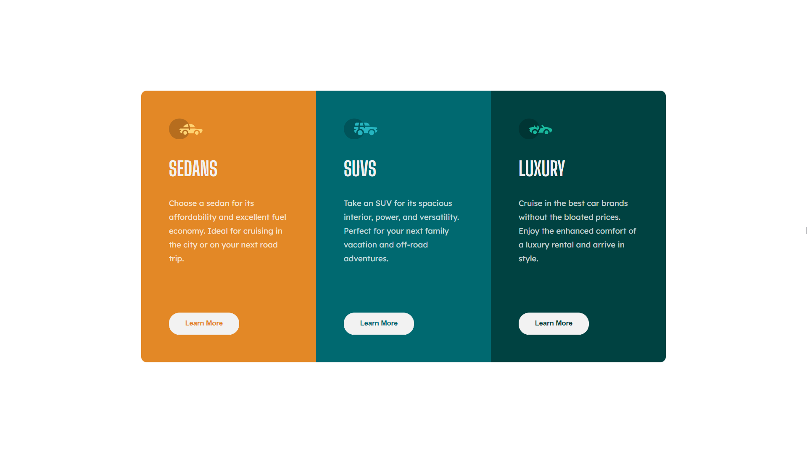

# 3-Column Preview Card

This is a solution to the [3-column preview card component challenge on Frontend Mentor](https://www.frontendmentor.io/challenges/3column-preview-card-component-pH92eAR2-). Frontend Mentor challenges help you improve your coding skills by building realistic projects.

## Table of contents

-   [Overview](#overview)
    -   [The challenge](#the-challenge)
    -   [Screenshot](#screenshot)
    -   [Links](#links)
-   [My process](#my-process)
    -   [Built with](#built-with)
    -   [What I learned](#what-i-learned)
-   [Author](#author)

## Overview

### The challenge

Users should be able to:

-   View the optimal layout depending on their device's screen size
-   See hover states for interactive elements

### Screenshot



### Links

-   [Solution](https://www.frontendmentor.io/solutions/responsive-info-columns-using-html5-sass-and-bem-methodology-HBjqZymwc)
-   [Live Site](https://codeline0.github.io/3-Column-Preview-Card/)

## My process

### Built with

-   Semantic HTML5 markup
-   [Sass](https://sass-lang.com/)
-   [BEM](http://getbem.com/) methodology
-   Grid
-   Desktop-first workflow
-   Responsive Design

### What I learned

Center an item without using flex or grid.

```css
.cards {
	top: 50%;
	left: 50%;
	transform: translate(-50%, -50%);
}
```

## Author

-   Frontend Mentor - [@Codeline0](https://www.frontendmentor.io/profile/Codeline0)
-   Marco Camez - [@Codeline0](https://www.github.com/CodeLine0)
